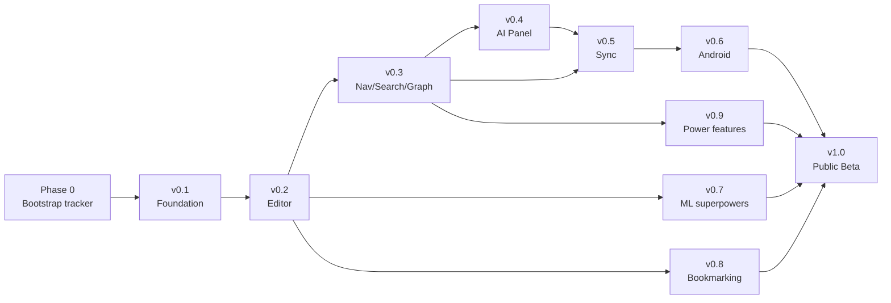

# Lattice — Complete Phase-wise Build Plan

> Scope: all 10 roadmap milestones, split into PR-sized work items and new ADRs.
> Source of truth for milestones: [ROADMAP.md](ROADMAP.md) and [.github/milestones.yml](.github/milestones.yml).
> Source of truth for existing ADRs: [docs/decisions/README.md](docs/decisions/README.md) (0001–0010 already accepted).

## Current state (May 2026)

- Governance, license, ADRs 0001–0010, vision, competitive research, label/milestone/epic YAMLs, CI baseline, and branch protection are **all in place**.
- v0.1 and v0.2 task issues are pre-cut in [.github/issues/v0.1-tasks.yml](.github/issues/v0.1-tasks.yml) and [.github/issues/v0.2-tasks.yml](.github/issues/v0.2-tasks.yml).
- **No application code exists yet** — `apps/`, `packages/`, `core/` are not on disk; `pnpm tauri dev` does not run.
- v0.3 through v1.0 only have **epic stubs** (in [.github/issues/epics.yml](.github/issues/epics.yml)); fine-grained task YAMLs need to be cut at milestone-prep time.

## Conventions used in this plan

- **PR** = a single, reviewable pull request following Conventional Commits ([ADR-0009](docs/decisions/0009-conventional-commits-trunk-based.md)). One PR ≈ one row in the per-milestone task YAML.
- **ADR** = a new architecture decision record in `docs/decisions/NNNN-<slug>.md`. ADRs land **as their own PR**, typically just before (or alongside) the first feature PR that depends on them.
- Each milestone gets its own `v0.X-tasks.yml` cut at the start of the milestone and pushed to GitHub via `node .github/scripts/bootstrap-issues.mjs`.

---

## Phase 0 — Bootstrap the tracker (this week)

Goal: turn the existing config-as-code into a live GitHub project so every later PR has a home.

- **PRs**: none required; these are one-shot scripts that mutate GitHub state.
  - Run `node .github/scripts/bootstrap-repo.mjs` (repo settings).
  - Run `node .github/scripts/sync-labels.mjs` then `sync-milestones.mjs`.
  - Run `node .github/scripts/bootstrap-project.mjs` (Project v2 + custom fields).
  - Run `node .github/scripts/bootstrap-issues.mjs` (epics + v0.1 + v0.2 tasks).
  - After the first CI run lights up the check names: `bootstrap-repo.mjs --apply-protection`.
- **ADRs**: none.

---

## v0.1 — Foundation (12 PRs, 4 ADRs)

Epic: [Epic: v0.1 — Foundation](.github/issues/epics.yml). Tasks already enumerated in [.github/issues/v0.1-tasks.yml](.github/issues/v0.1-tasks.yml).

**PRs (in suggested merge order):**

1. `feat(repo): pnpm + Turborepo monorepo scaffolding` — `pnpm-workspace.yaml`, `turbo.json`, `tsconfig.base.json`, Rust workspace `Cargo.toml`.
2. `feat(core): Rust core crate with sqlx + SQLite schema migration` — `core/lattice-core` compiles, `sqlx::migrate!()` against fresh SQLite, `ts-rs` bindings into `packages/core-bindings`.
3. `feat(desktop): Tauri 2 shell builds on Windows + Linux in CI` — `apps/desktop` boots a Hello-Lattice window; cold-start measured.
4. `feat(ui): React + Vite + TailwindCSS + shadcn/ui scaffolding` — `packages/ui` with shadcn primitives + Storybook.
5. `feat(ui): design-token round-trip from packages/ui to Tailwind preset` — single source of truth for tokens (good first issue).
6. `feat(core): vault open / create / switch` — `vault.*` Tauri commands; last-opened path persisted.
7. `feat(core): file watcher + reactive index` — `notify` + 200 ms debounce; emits Tauri events.
8. `feat(core): structured logging, error model, telemetry opt-in` — `tracing`, `thiserror` `LatticeError`, off-by-default telemetry to a self-hostable endpoint.
9. `feat(ui): initial visual identity — typography, logo, app icon` — self-hosted fonts, wordmark SVG, splash screen, token CSS variables live.
10. `perf(core): criterion bench harness for v0.1 perf budgets` — gates regressions on vault-open, save+index, watcher latency.
11. `ci(repo): tighten CI baseline once monorepo scaffolds` — turn on `frontend (*)` and `rust (*)` matrix jobs; re-apply branch protection.
12. `docs(adr): track follow-up ADRs spawned by v0.1 implementation` — meta-issue that spawns ADRs 0011–0014.

**New ADRs (cut as we hit the decisions):**

- **ADR-0011** — Font-loading strategy (subset, swap, FOUT vs FOIT).
- **ADR-0012** — Telemetry event schema and versioning.
- **ADR-0013** — Vault-conflict resolution UX (last-writer-wins vs prompt) when the file watcher sees an external mid-edit change.
- **ADR-0014** — File-watcher debounce window and platform quirks (notify on Linux inotify limits, Windows ReadDirectoryChangesW).

**Exit criteria:** `pnpm install && pnpm tauri dev` opens the shell, a vault folder can be opened, the index is built and survives a restart, perf benches gate CI.

---

## v0.2 — The Editor (6 PRs, 3 ADRs)

Epic: [Epic: v0.2 — The Editor](.github/issues/epics.yml). Tasks pre-cut in [.github/issues/v0.2-tasks.yml](.github/issues/v0.2-tasks.yml).

**PRs:**

1. `feat(editor): TipTap block editor with slash command menu` — `packages/editor/`, all v0.2 block types, <16 ms slash menu open.
2. `feat(editor): Markdown round-trip + golden-corpus test suite` — Rust + TS parser/serializer pair; `tests/markdown-roundtrip/` gates CI byte-identical.
3. `feat(editor): CodeMirror 6 embedded in code-block nodes` — real CM6 inside the block; 20+ langs preloaded.
4. `feat(editor): [[wiki-link]] autocomplete + click-to-navigate` — fuzzy + recency bias; auto-create on missing.
5. `feat(editor): KaTeX, Mermaid, Excalidraw embeds` — inline + block math, mermaid fences, Excalidraw with `.excalidraw.json` + PNG snapshot.
6. `feat(ux): command palette (⌘K / Ctrl+K)` — shadcn `command` primitive; first set of registered commands (good first issue).

**New ADRs:**

- **ADR-0015** — Markdown flavor & serializer (CommonMark + GFM extensions; how we serialize custom nodes like wiki-links and callouts).
- **ADR-0016** — Image / attachment handling (sibling `attachments/` folder vs embedded data URIs vs vault-relative paths).
- **ADR-0017** — Excalidraw embed storage format (`.excalidraw.json` sidecar + PNG render policy).

**Exit criteria:** end-to-end "open vault → type a block-rich note → save → reopen → byte-identical Markdown on disk".

---

## v0.3 — Navigation, Search, Graph (8 PRs, 3 ADRs)

Epic exists; cut `v0.3-tasks.yml` at milestone start.

**PRs:**

1. `feat(search): Tantivy index in lattice-search crate` — index schema, writers, segment compaction.
2. `feat(search): live re-indexing on save` — pipe from file watcher + editor save into Tantivy + SQLite metadata.
3. `feat(search): query DSL + parser` — operators `tag:`, `path:`, `created:`, fuzzy, phrase, field-scoped.
4. `feat(ui): search modal` — keyboard-first, preview pane, snippet highlighting.
5. `feat(graph): backlinks panel + unlinked-mention detection` — uses SQLite link table; refreshed on save.
6. `feat(ui): tag tree, folder tree, favorites, pinned` — left sidebar; drag-to-reorder.
7. `feat(graph): local + global graph view (Cytoscape.js)` — filters, color by tag, depth slider; meets 100 ms / 1k-node budget.
8. `feat(editor): daily-notes` — date-templated note, jump-to-today command.

**New ADRs:**

- **ADR-0018** — Search query grammar (custom DSL vs Tantivy-native QueryParser vs hybrid).
- **ADR-0019** — Graph snapshot data shape, paging, and node/edge limits for the global view.
- **ADR-0020** — Backlinks staleness model (eventual vs synchronous on save).

**Exit criteria:** 10k-note corpus search returns <30 ms p99; graph view renders 1k nodes <100 ms; backlinks update within 1 s of save.

---

## v0.4 — AI Panel (8 PRs, 4 ADRs)

Cut `v0.4-tasks.yml` at milestone start.

**PRs:**

1. `feat(ai): provider abstraction trait in lattice-ai` — `Provider`, `ChatStream`, `Embedder` traits; mock provider for tests.
2. `feat(ai): OpenAI provider adapter` — streaming chat, embeddings, structured outputs.
3. `feat(ai): Anthropic provider adapter` — Claude streaming + tool-use surface.
4. `feat(ai): Ollama provider adapter` — local-first path; model discovery; pull/run.
5. `feat(ai): OS keychain integration for API keys` — `keyring` crate; never persisted plaintext.
6. `feat(ai): local embeddings via fastembed-rs + chunker` — chunking strategy, persistence in SQLite/Tantivy.
7. `feat(ai): RAG retrieval pipeline + vector store` — query → retrieve → rerank → assemble context.
8. `feat(ai): chat panel UI` — streaming, citations to source notes, "open in editor" buttons.
9. `feat(ai): per-note actions (summarize / flashcards / find related)` — surfaced in the command palette and note menu.
10. `feat(ai): AI-suggested tags + titles` — async on save; user accepts/rejects.
11. `feat(ai): prompt library (user-editable)` — YAML in `.lattice/prompts/`; variables; share/export.

**New ADRs:**

- **ADR-0021** — AI provider trait shape (where do tools / structured outputs live).
- **ADR-0022** — Embedding model default (bge-small-en vs gte-small vs MiniLM); on-device size budget.
- **ADR-0023** — Vector store choice (`sqlite-vec` extension vs Tantivy ANN vs LanceDB sidecar).
- **ADR-0024** — Privacy/redaction policy when calling cloud providers (vault-content egress gate, opt-in scopes).

**Exit criteria:** chat-with-your-vault works fully offline against an Ollama model; BYO-key path against OpenAI/Anthropic stores keys in OS keychain; no network egress unless the user enabled it.

---

## v0.5 — Sync (Self-hostable) (8 PRs, 3 ADRs)

Cut `v0.5-tasks.yml` at milestone start.

**PRs:**

1. `feat(sync): yrs CRDT model behind the editor doc` — `y-prosemirror` binding; per-note Yjs doc.
2. `feat(sync): .note.crdt sibling file format + lifecycle` — only when sync is enabled, per [ADR-0005](docs/decisions/0005-yrs-crdt-sync.md).
3. `feat(server): Axum + y-sync WebSocket relay (lattice-server)` — auth, room model, persistence adapter.
4. `feat(server): S3-compatible blob store adapter` — local minio for tests, real S3/R2 in prod.
5. `feat(sync): libsodium E2EE wrap of CRDT updates` — server only sees ciphertext.
6. `feat(sync): device pairing + key exchange UX` — QR code or one-time code flow.
7. `feat(sync): two-device conflict-free reconciliation E2E test harness` — offline edits on both → reconnect → converge.
8. `docs(deploy): one-tap deploy guides (Fly.io, Railway, Docker Compose)`.

**New ADRs:**

- **ADR-0025** — Sync-server architecture (pure relay vs metadata-aware vs hybrid).
- **ADR-0026** — Device pairing & key management UX (recovery phrase vs per-device keypair vs both).
- **ADR-0027** — Yjs schema versioning + migration strategy (avoid orphaning history).

**Exit criteria:** two devices, each editing the same note offline, converge on reconnect with no data loss and no manual conflict UX; sync-server image deploys to a fresh VPS in <5 min.

---

## v0.6 — Android (8 PRs, 2 ADRs)

Cut `v0.6-tasks.yml` at milestone start.

**PRs:**

1. `feat(mobile): Tauri 2 Android target wired into monorepo` — `apps/mobile`, `cargo-ndk` config.
2. `ci(mobile): Android matrix build green` — `pnpm tauri android build` in CI.
3. `feat(mobile): touch-first nav` — bottom sheets, swipe nav, large hit targets.
4. `feat(mobile): mobile editor profile` — TipTap gestures, virtual-keyboard handling, slim CM6 view-only on weak devices.
5. `feat(mobile): vault on shared storage` — Android SAF / scoped storage adapter.
6. `feat(mobile): share-sheet receiver` — share-to-Lattice intent.
7. `feat(mobile): offline-first sync + reconnect` — leverages v0.5 sync layer.
8. `feat(release): F-Droid metadata + signed APK pipeline`.

**New ADRs:**

- **ADR-0028** — Mobile vault storage (SAF vs app-private with explicit export).
- **ADR-0029** — Mobile editor subset (full TipTap vs reduced read-mostly view + dedicated compose mode).

**Exit criteria:** Lattice opens on an Android 10+ device, opens a vault from shared storage, edits offline, syncs when online, survives backgrounded→foregrounded cycle.

---

## v0.7 — Engineering & ML superpowers (9 PRs, 3 ADRs)

Cut `v0.7-tasks.yml` at milestone start.

**PRs:**

1. `feat(editor): Jupyter .ipynb import + read-only render` — outputs rendered, code blocks reuse CM6.
2. `feat(blocks): Dataset typed block` — schema, splits, license, source URI.
3. `feat(blocks): Model typed block` — params, dataset link, benchmark scores.
4. `feat(blocks): Experiment typed block + log template` — run metadata, metric panels.
5. `feat(integrations): optional W&B / MLflow fetcher` — pull-only; opt-in per workspace.
6. `feat(citations): DOI / arXiv lookup → auto paper note` — title/authors/abstract/BibTeX.
7. `feat(citations): BibTeX import + export` — round-trip.
8. `feat(graph): Connected-Papers-style citation graph` — uses citations data source.
9. `feat(integrations): code-aware backlinks` — link to symbol/line in a Git repo; refresh on push.

**New ADRs:**

- **ADR-0030** — Typed-block storage (YAML frontmatter vs JSON sidecar vs ProseMirror nodeAttrs).
- **ADR-0031** — Citation data source (OpenAlex vs Semantic Scholar vs Crossref; offline cache).
- **ADR-0032** — Code-aware backlinks refresh strategy (webhook vs poll vs on-demand).

**Exit criteria:** an ML researcher pastes an arXiv URL and gets a structured paper note with bibliography, a citation-graph node, and a "Connected Papers"-style view.

---

## v0.8 — Bookmarking (7 PRs, 2 ADRs)

Cut `v0.8-tasks.yml` at milestone start.

**PRs:**

1. `feat(extension): browser extension skeleton (MV3, Chrome/Firefox/Edge)` — `extensions/web-clipper`.
2. `feat(extension): native-messaging host` — Tauri ↔ extension bridge.
3. `feat(extension): readability extraction + Markdown save` — clean MD, not HTML soup.
4. `feat(bookmarking): offline archive + screenshot` — stored under `.lattice/attachments/`.
5. `feat(bookmarking): YouTube / podcast clipper` — transcript pull, timestamped highlights.
6. `feat(bookmarking): read-later queue + spaced-repetition resurface` — surfaces in the daily note.
7. `feat(ai): duplicate-detection across clippings` — reuses embeddings from v0.4.

**New ADRs:**

- **ADR-0033** — Extension ↔ desktop messaging (Chrome native messaging vs local HTTP vs Tauri deep link).
- **ADR-0034** — Transcript provider abstraction (YouTube captions vs Whisper local vs cloud STT).

**Exit criteria:** clicking the extension on a Chrome article saves it as a readable, offline-archived note in <2 s.

---

## v0.9 — Power features (8 PRs, 5 ADRs)

Cut `v0.9-tasks.yml` at milestone start.

**PRs:**

1. `feat(history): per-note Git-style history` — in-process libgit2 backing `.lattice/history/`.
2. `feat(ui): time-travel viewer (diff + blame)` — side-by-side and inline modes.
3. `feat(canvas): infinite canvas (Excalidraw-derived)` — nodes back real notes.
4. `feat(data): DuckDB-on-SQLite sidecar` — read-only SQL over the metadata DB.
5. `feat(data): SQL query panel + saved queries` — results to table / CSV / new note.
6. `feat(sdk): WASM plugin runtime` — `wasmtime` or `wasmer`; capability tokens for FS / network / UI.
7. `feat(sdk): plugin manifest + signed manifests` — versioned, opt-in capabilities.
8. `feat(sdk): plugin marketplace stub + theme marketplace` — read-only registry to start.

**New ADRs:**

- **ADR-0035** — History engine (libgit2 in-process vs custom diff log vs bare-Git sidecar).
- **ADR-0036** — DuckDB embedding strategy (in-process vs sidecar process) — answers an open question already in [ARCHITECTURE.md](ARCHITECTURE.md).
- **ADR-0037** — WASM runtime (`wasmtime` vs `wasmer`); WASI feature surface.
- **ADR-0038** — Plugin permission / capability model.
- **ADR-0039** — Marketplace governance (curated vs open vs federated registry).

**Exit criteria:** at least one community-authored plugin runs sandboxed with FS-scoped capabilities; a user query like `SELECT title FROM notes WHERE tag = 'aiml'` runs against the vault.

---

## v1.0 — Public Beta (8 PRs, 4 ADRs)

Cut `v1.0-tasks.yml` at milestone start.

**PRs:**

1. `perf: enforce all ARCHITECTURE budgets in CI` — fail on >10% regression vs baseline against a 10k-note corpus.
2. `feat(a11y): WCAG 2.2 AA audit + fixes` — keyboard nav, screen-reader labels, focus traps, contrast.
3. `feat(i18n): i18n scaffolding` — FormatJS / Lingui pick (per ADR below); message extraction in CI.
4. `feat(i18n): first 3 locales` — string coverage >90% each.
5. `feat(release): Windows EV code-signing + Linux signing` — secrets in CI vault.
6. `feat(release): auto-update flow with signed manifests` — Tauri updater plugin; rollback policy.
7. `docs(site): public docs site` — Astro/Nextra/Docusaurus per ADR; deploy to `lattice.example.org`.
8. `chore(launch): HN launch post + landing page + first-3-locales rollout`.

**New ADRs:**

- **ADR-0040** — i18n framework (FormatJS vs Lingui vs Fluent) and ICU MessageFormat.
- **ADR-0041** — Code-signing strategy (Windows EV cert holder; Linux AppImage zsync + GPG).
- **ADR-0042** — Auto-update manifest schema + rollback policy.
- **ADR-0043** — Public docs site framework.

**Exit criteria:** signed installers for Windows + Linux on a download page; docs site live; HN launch scheduled; perf budgets green on the last 30 release tags.

---

## Cross-cutting workstreams (run continuously)

- **Dependabot / CVE response** — already enabled via [.github/dependabot.yml](.github/dependabot.yml). Triage weekly.
- **Documentation** — every user-visible PR carries CHANGELOG + (when relevant) docs-site copy.
- **Performance benches** — added once in v0.1, extended every milestone (search in v0.3, AI latency in v0.4, sync round-trip in v0.5, mobile cold-start in v0.6).
- **Security** — threat model updated after v0.4 (AI), v0.5 (sync server), v0.9 (plugins). [SECURITY.md](SECURITY.md) defines disclosure flow.

---

## Next steps (do these in order)

1. **Decide whether to execute Phase 0 now** — run the four `bootstrap-*.mjs` scripts so the labels / milestones / Project v2 board / epics / v0.1 + v0.2 issues exist on GitHub. Without this, every later PR has no issue to close.
2. **Open PR #1** of v0.1: `feat(repo): pnpm + Turborepo monorepo scaffolding`. This unblocks every other v0.1 PR.
3. **In parallel**, open the ADR-0011 (font-loading) PR — it's a small, contained decision that the v0.1 visual-identity PR will need.
4. **After PR #1 merges**, fan out v0.1 PRs in this order: core crate → desktop shell → UI scaffolding → vault → watcher → logging → visual identity → benches → CI tightening.
5. **At the end of v0.1**, sit down for ~30 min and cut `v0.3-tasks.yml` (the next un-pre-cut milestone) so v0.2 contributors can see the road ahead.
