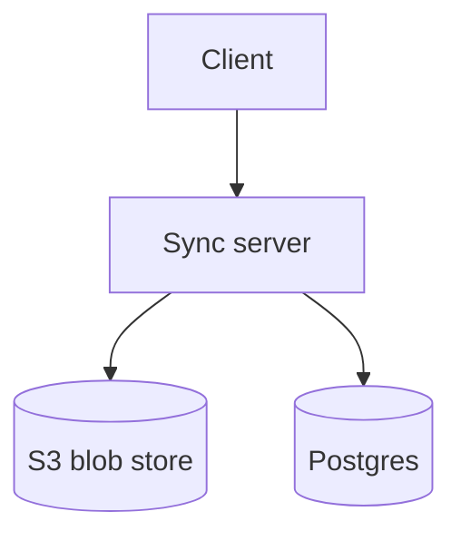

# Markdown flavor

> What Markdown Lattice reads and writes. The short version: it's
> CommonMark + GitHub-Flavored Markdown plus a small, documented set
> of Lattice extensions. The contract is locked by
> [ADR-0015](../decisions/0015-markdown-flavor-and-serialization.md).

If you've used **Obsidian, GitHub Markdown, or Bear** before, you'll
recognise most of this on sight.

## Frontmatter

YAML between `---` fences at the top of the file:

```markdown
---
id: 0192f1d4-7c41-7b22-b1a5-71e1f8c74522
title: Distributed Systems
tags: [systems, papers]
created: 2026-04-12T10:00:00Z
updated: 2026-05-13T14:21:00Z
aliases: [Distributed Systems Reading List]
---

# Distributed Systems

…
```

Lattice preserves the **key order** you write — re-saving doesn't
re-sort. Custom keys are kept verbatim; the typed fields above are
the ones the app reads and indexes.

## Standard Markdown

Everything you'd expect from CommonMark + GFM:

```markdown
# H1

## H2

### H3 …

**bold**, _italic_, ~~strikethrough~~, `inline code`.

- bullet list
  - nested
- and so on

1. ordered list
2. second item

> blockquote
> on multiple lines

[link text](https://example.com)
```

GFM extensions:

```markdown
| header | header |
| ------ | ------ |
| cell   | cell   |

- [ ] task list item
- [x] checked item

Auto-linking: <https://example.com>
```

We **don't** emit setext headings (`====` underlines); you can write
them, and they round-trip as ATX (`#`) headings on save.

## Code blocks

Triple-backtick fences, with a language tag for syntax highlighting:

````markdown
```rust
fn quorum(n: usize) -> usize { n / 2 + 1 }
```

```python
def quorum(n): return n // 2 + 1
```
````

The editor wires CodeMirror 6 inside each code block — proper
syntax highlighting, search, multi-cursor editing inside the code.
~14 languages ship by default; the full list lives in
[`packages/editor/src/tiptap/codemirror/languages.ts`](../../packages/editor/src/tiptap/codemirror/languages.ts).

## Wiki links

Lattice's `[[Title]]` syntax for linking to other notes:

```markdown
See also [[Distributed Systems]] and [[Vector Clocks|clocks]].
```

Resolution rules:

1. Match `Title` exactly against another note's frontmatter `title`.
2. Fall back to its `aliases`.
3. If no match, the link is "unlinked" — clicking it offers to
   create a new note with that title.

The `|alias` form lets you customise the displayed text without
breaking the resolution.

## Callouts

GitHub-compatible callout syntax:

```markdown
> [!info]
> Two reads to start: Lamport's paper, then Brewer's CAP.

> [!warn]
> Don't run this in production.

> [!tip]
> Pin compile-time SQL queries to catch schema drift early.
```

Three kinds in v0.2: `info`, `warn`, `tip`. Each renders with an
icon and an accent colour bound to the
[design tokens](../decisions/0010-design-tokens-and-typography.md).
Other Markdown readers see plain blockquotes — readable, just not
as pretty.

## Math (KaTeX)

Inline:

```markdown
The vector clock comparison is $a \le b \iff \forall i: a_i \le b_i$.
```

Block:

```markdown
$$
\Delta_{\text{quorum}} = \left\lfloor \frac{n}{2} \right\rfloor + 1
$$
```

Rendered via KaTeX. The font subset and the styling are controlled
by [`packages/editor/src/tiptap/katex-fonts.css`](../../packages/editor/src/tiptap/katex-fonts.css) and
[`packages/editor/src/tiptap/math.css`](../../packages/editor/src/tiptap/math.css).

## Diagrams (Mermaid)

````markdown

````

Rendered client-side via the `mermaid` package. Other tools see a
fenced code block with `mermaid` info-string.

## Sketches (Excalidraw)

````markdown
```excalidraw
{ "type": "excalidraw", "version": 2, "elements": [ ... ] }
```
````

Lattice opens the JSON in an embedded Excalidraw runtime, lets you
edit the diagram, and saves both the JSON sidecar and a PNG snapshot
under `<vault>/.lattice/attachments/<note-id>/` per
[ADR-0017](../decisions/0017-excalidraw-embed-storage.md). Tools
without Excalidraw see the PNG.

## Footnotes

GFM-style:

```markdown
This claim has a citation.[^1]

[^1]: Lamport, "Time, Clocks, and the Ordering of Events" (1978).
```

Out-of-order definitions and multi-paragraph footnotes round-trip
correctly — the round-trip corpus locks down both
([`tests/markdown-roundtrip/footnotes.md`](../../tests/markdown-roundtrip/footnotes.md)).

## Hard line breaks

Two trailing spaces:

```markdown
First line.<spaces>
Second line.
```

Or the explicit `\` form:

```markdown
First line.\
Second line.
```

Lattice round-trips whichever you wrote. It doesn't normalise to
one form because that would change other people's files.

## Raw HTML

Sometimes you really do want a `<details>` block:

```markdown
<details>
<summary>Click to expand</summary>

Hidden by default.

</details>
```

Lattice passes raw HTML through unchanged. We test this in
[`tests/markdown-roundtrip/html-snippet.md`](../../tests/markdown-roundtrip/html-snippet.md).

## Tables with weird cells

GFM tables where a cell contains backtick-fenced inline code with a
literal `|`:

```markdown
| token | meaning      |
| ----- | ------------ |
| `\|`  | literal pipe |
| `&&`  | logical AND  |
```

Yes, this works on round-trip. The rule: the parser knows that
`|` inside backticks is content, not a column separator.
[`tests/markdown-roundtrip/tables-with-pipes-in-code.md`](../../tests/markdown-roundtrip/tables-with-pipes-in-code.md)
is the regression test.

## What's coming

Lands in v0.7 as part of the engineering & ML milestone:

- **Typed blocks** — `lattice:dataset`, `lattice:model`,
  `lattice:experiment`, `lattice:citation`. Each rendered as a
  rich panel inside Lattice; serialised as a fenced code-block with
  JSON content so other Markdown readers see something readable
  (per [ADR-0015](../decisions/0015-markdown-flavor-and-serialization.md)).

Until then, you can use plain frontmatter `type:` to tag notes —
search and tagging both pick it up.

## What we explicitly don't support

- **Pandoc-style citations** (`[@key]`). Citations land in v0.7 as
  a typed block, not as Pandoc references.
- **Emoji shortcodes** (`:smile:`). Use Unicode directly.
- **Setext headings** on output. We accept them on input;
  serialise to ATX (`#`).
- **Indented code blocks** on output. Use fenced (` ``` `) — we
  serialise that way.
- **CommonMark autolinks without angle brackets**. We require either
  `<https://…>` or `[text](https://…)`.

## Why this exact dialect

Three forces:

1. **`grep`- and `vim`-friendly** — the on-disk format is what a
   user can read in any editor.
2. **Block-rich** — TipTap can do callouts, math, embeds, typed
   nodes; vanilla CommonMark can't.
3. **Cross-tool readable** — Obsidian, GitHub, Bear, and others
   render most of this gracefully even without knowing about
   Lattice.

The full reasoning is in
[ADR-0015](../decisions/0015-markdown-flavor-and-serialization.md).

## See also

- [`vault-basics.md`](vault-basics.md) — what a vault is, where
  notes live.
- [`keyboard-shortcuts.md`](keyboard-shortcuts.md) — keyboard
  bindings to fly through the editor.
- [`../architecture/editor-internals.md`](../architecture/editor-internals.md)
  — the parser / serialiser / round-trip story for contributors.
